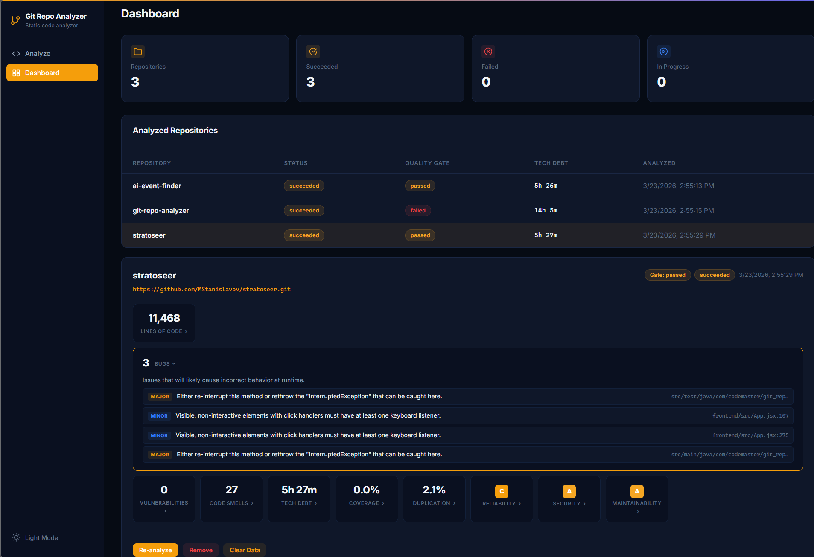
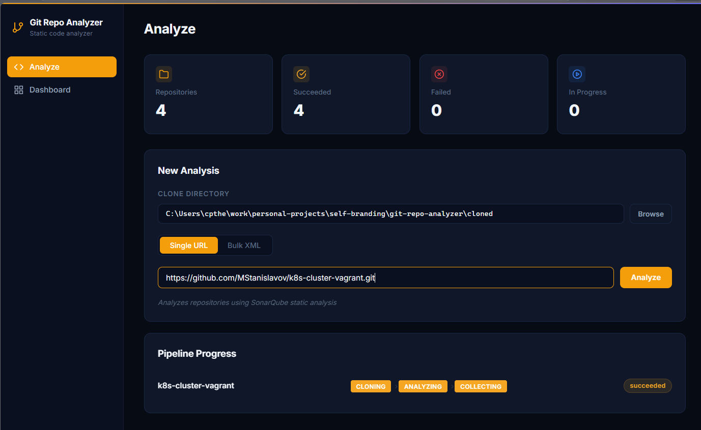

<p align="center">
  
</p>

<p align="center">
  <strong>Analyze any Git repository for code quality, security vulnerabilities, and technical debt in one click.</strong>
</p>

<p align="center">
  
  
  
  
  
</p>

---

## Overview

Git Repo Analyzer is a self-hosted dashboard that runs SonarQube static analysis against any Git repository and presents the results in a clean, interactive UI. Submit a repo URL, watch the pipeline progress in real time, and drill into every metric, from bugs and vulnerabilities down to individual issue locations in your code.

<p align="center">
  
</p>


## Features

- **One-click analysis** – paste a Git URL and hit Analyze. Bulk analysis via XML is also supported.
- **Real-time pipeline** – watch cloning, scanning, and data collection progress streamed live to the browser.
- **Expandable metrics** – click any metric card (Bugs, Vulnerabilities, Code Smells, etc.) to see the actual issues from SonarQube with severity, description, and file location.
- **Quality gate** – instantly see whether a repository passes or fails SonarQube's quality gate.
- **Full metric suite** – lines of code, tech debt, test coverage, duplication, and A-E ratings for reliability, security, and maintainability.
- **Dark and light themes** – toggle between themes from the sidebar.
- **Concurrent pipeline** – analyze multiple repositories in parallel with configurable concurrency limits.

## Quick Start

### Prerequisites

- Java 25
- Maven 3.9.7+
- Docker and Docker Compose
- Git CLI

### 1. Clone and configure

```bash
git clone https://github.com/CodeMaster10000/git-repo-analyzer.git
cd git-repo-analyzer
cp .env.example .env
```

Edit `.env` with your passwords and preferred clone directory.

### 2. Start the infrastructure

```bash
docker compose up -d
```

This brings up SonarQube (port `9000`) and PostgreSQL (port `5433`).

### 3. Generate a SonarQube token

1. Open `http://localhost:9000` (default login: `admin` / `admin`)
2. Go to **My Account > Security > Tokens** and generate a token
3. Add it to `.env` as `SONAR_TOKEN`

### 4. Build and run

```bash
mvn clean install
java -jar target/git-repo-analyzer-0.0.1-SNAPSHOT.jar
```

Open **http://localhost:8080** in your browser.

## Configuration

| Variable | Default | Description |
|----------|---------|-------------|
| `SONARQUBE_URL` | — | SonarQube server URL |
| `SONAR_TOKEN` | — | SonarQube authentication token |
| `CLONE_TARGET_DIR` | `D:/clone-dirs` | Local directory for cloned repositories |
| `APP_DB_HOST` | `localhost` | PostgreSQL host |
| `APP_DB_PORT` | `5432` | PostgreSQL port |
| `APP_DB_USER` | `analyzer` | Database username |
| `APP_DB_PASSWORD` | `analyzer` | Database password |

Pipeline concurrency can be tuned in `application.properties`:

```properties
pipeline.clone.max-concurrent=10
pipeline.sonar-analysis.max-concurrent=5
```

## How It Works

```
Submit repo URL
  └─ Clone repository (Git CLI, virtual threads)
       └─ Run SonarQube scanner (Docker container)
            └─ Collect metrics (SonarQube REST API)
                 └─ Display results (SSE → React dashboard)
```

The application is built as an **event-driven modulith** using Spring Modulith. Each pipeline stage runs asynchronously and communicates through application events, with progress streamed to the frontend via Server-Sent Events.

## API

| Method | Endpoint | Description |
|--------|----------|-------------|
| `POST` | `/api/v1/analyze/url` | Analyze a single repository |
| `POST` | `/api/v1/analyze/xml` | Bulk analyze from XML |
| `GET` | `/api/v1/analyze/stream` | SSE stream for pipeline progress |
| `GET` | `/api/v1/results` | List all analysis results |
| `GET` | `/api/v1/results/{repoName}` | Get results for a specific repo |
| `GET` | `/api/v1/sonar/issues` | Fetch detailed issues from SonarQube |
| `DELETE` | `/api/v1/results/{id}` | Remove a repository |

Full API documentation is available at `/swagger-ui.html` when the application is running.

## Tech Stack

| Layer | Technology |
|-------|-----------|
| Backend | Java 25, Spring Boot 4.0, Spring Modulith 2.0 |
| Frontend | React 19, Vite 8 |
| Database | PostgreSQL 16 |
| Analysis Engine | SonarQube 10 Community Edition |
| Infrastructure | Docker Compose |

## License

This project is for personal and educational use.
